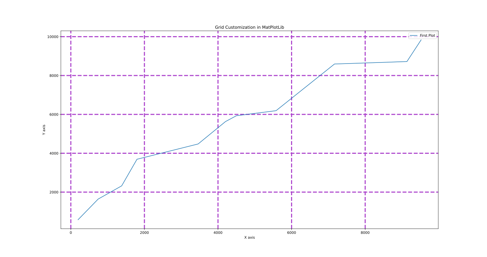
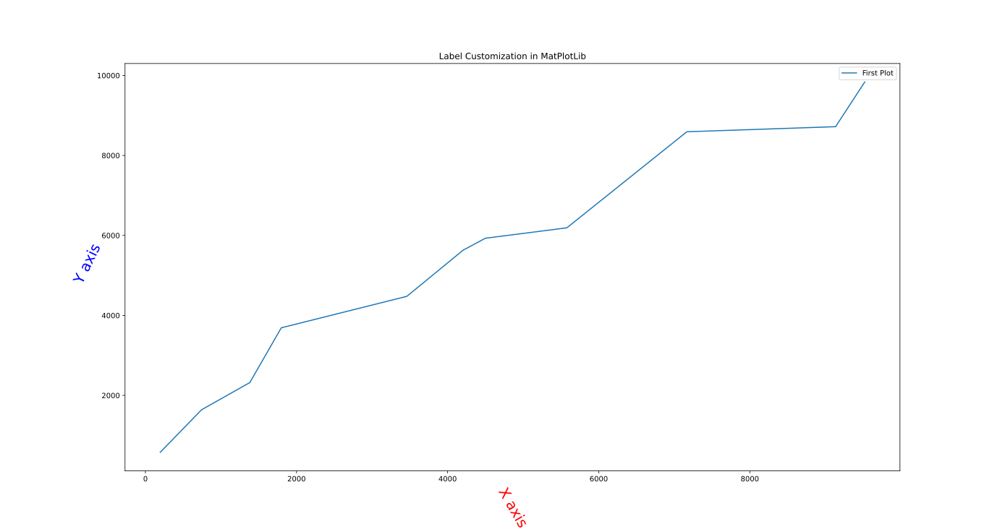
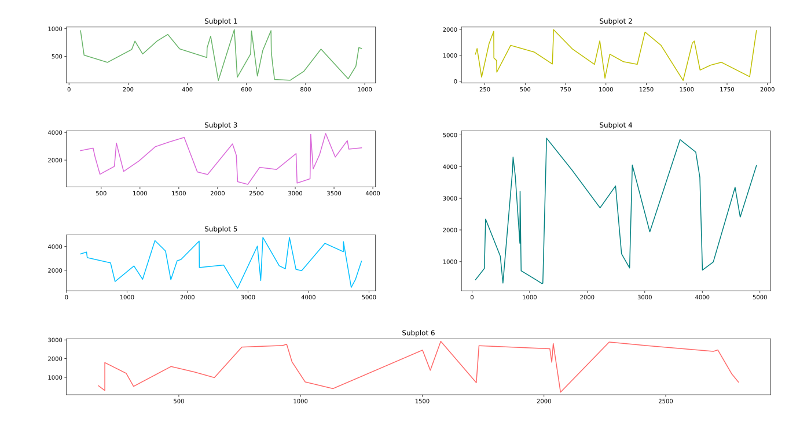

# MatPlotLib
These tutorials are watched from [**_sentdex_**](https://www.youtube.com/channel/UCfzlCWGWYyIQ0aLC5w48gBQ "Clike here to checkout his channel") YouTube channel from [**_MatPlotLib Playlist_**](https://youtube.com/playlist?list=PLQVvvaa0QuDfefDfXb9Yf0la1fPDKluPF "Clike here to check out his MatPlotLib tutorials Playlist")
---
---
---
---
---
---
## Tutorial 1

### You will learn to plot line graph in this Tutorial

```python
# Date 15-06-2021

import matplotlib.pyplot as plt

plt.plot([-2, -4, -1, -2,  5,  2, -6], [-6,  0, 10,  3,  2,  0, -4])


plt.show()
```

### The above code will produce the following output

## 

---

---

---

---

---

## Tutorial 2_1

### You will learn about Legends titles and labels in this Tutorial

```python
# Date 16-06-2021

import matplotlib.pyplot as plt

x = [0,  10,  -4,  -2,   5]
y = [1,   3,  -4, -5,   1]

x2 = [9, -10,   2,  -9,  -1]
y2 = [6,  -8,   7,  -1,  -3]


plt.plot(x, y, label='first plot')
plt.plot(x2, y2, label='second plot')
plt.xlabel('X Label')
plt.ylabel('Y Label')
plt.title('This is a title\nSub title')

plt.show()
```

### The above code will produce the following output

## 

---

## Tutorial 2_2

### You will learn about Legends titles and labels in this Tutorial

```python
# Date 16-06-2021

import matplotlib.pyplot as plt

x = [1,  2,  3,  4,   5, 6, 7]
y = [1,  2,  3,  4,   5, 6, 7]


x2 = [1,  2,  3,  4,   5, 6, 7]
y2 = [0,  1,  2,  3,   4, 5, 6]


plt.plot(x, y, label='first plot')
plt.plot(x2, y2, label='second plot')
plt.xlabel('X Label')
plt.ylabel('Y Label')
plt.title('This is a title\nSub title')

plt.show()
```

### The above code will produce the following output

## 

---

---

---

---

---

## Tutorial 3_1

### You will learn about bar graphs in this Tutorial

```python
# Date 16-06-2021

import matplotlib.pyplot as plt

x = [8,   0,   2,  5,   7]
y = [3,   6,   2,  5,  10]

x2 = [8,  10,   5,  6,   3]
y2 = [8,  4,   6,  2, 4]


plt.bar(x, y, label='Graph 1', color='g')
plt.bar(x2, y2, label='Graph 2', color='r')

plt.xlabel('X Label')
plt.ylabel('Y Label')
plt.title('Bar Graphs')
plt.legend()
plt.show()
```

### The above code will produce the following output

## 

---

## Tutorial 3_2

### You will learn about Histogram in this Tutorial

```python
# Date 16-06-2021

import matplotlib.pyplot as plt

ages = [84,  40,  23,  44,  91,  36,  60,  94,  72,  39,  32,   5, 119,
        61, 127,  76,  61,  92,  41,  18,  12,  55, 117,  90,  47,  70,
        108,  97,   8,  40,  34,  43, 130, 109, 129, 115,  64, 113,  99,
        61,  10,   7,  38,  53, 124,  80,  46,  60,  48,  61, 102,  31,
        4, 100,  30,  99, 115, 114,  19, 9]


how_many_people_exists_of_that_age = [
    0, 10, 20, 30, 40, 50, 60, 70, 80, 90, 100, 110, 120, 130]

plt.hist(ages, how_many_people_exists_of_that_age,
         histtype='bar', rwidth=0.9, color='#BC0786')

plt.xlabel('Ages')
plt.ylabel('People Exists')
plt.title('Histogram')
# plt.legend()
plt.show()
```

### The above code will produce the following output

## 

---

---

---

---

---

## Tutorial 4_1

### You will learn about Scatter Plots in this Tutorial

```python
# Date 16-06-2021

import matplotlib.pyplot as plt

x = [8,   0,   2,  5,   7]
y = [3,   6,   2,  5,  10]

x2 = [8,  10,   5,  6,   3]
y2 = [8,  4,   6,  2, 4]


plt.bar(x, y, label='Graph 1', color='g')
plt.bar(x2, y2, label='Graph 2', color='r')

plt.xlabel('X Label')
plt.ylabel('Y Label')
plt.title('Scatter Plots')
plt.legend()
plt.show()
```

### The above code will produce the following output

## 

---

## Tutorial 4_2

### You will learn about Scatter Plots in this Tutorial

```python
# Date 16-06-2021


import matplotlib.pyplot as plt
from random import shuffle
from random import randint as rd


def rd_color():

    random_number = rd(0, 16777215)
    hex_number = str(hex(random_number))
    hex_number = '#' + hex_number[2:]
    return hex_number


def sh():
    global x, y
    x_y_for_function = [1, -2, 3, -4, 5, -6, 7, -8,
                        9, -10, -1, 2, -3, 4, -5, 6, -7, 8, -9, 10]
    shuffle(x_y_for_function)
    x = x_y_for_function[:10]
    shuffle(x_y_for_function)
    y = x_y_for_function[:10]


x = []
y = []


sh()
plt.scatter(x, y, color=rd_color(), marker='>', s=rd(30, 45))

sh()
plt.scatter(x, y, color=rd_color(), marker='<', s=rd(30, 45))

sh()
plt.scatter(x, y, color=rd_color(), marker='X', s=rd(30, 45))

sh()
plt.scatter(x, y, color=rd_color(), marker='x', s=rd(30, 45))

sh()
plt.scatter(x, y, color=rd_color(), marker='1', s=rd(30, 45))

sh()
plt.scatter(x, y, color=rd_color(), marker='4', s=rd(30, 45))

sh()
plt.scatter(x, y, color=rd_color(), marker='8', s=rd(30, 45))

sh()
plt.scatter(x, y, color=rd_color(), marker='s', s=rd(30, 45))

sh()
plt.scatter(x, y, color=rd_color(), marker='p', s=rd(30, 45))

sh()
plt.scatter(x, y, color=rd_color(), marker='$a$', s=rd(30, 45))

sh()
plt.scatter(x, y, color=rd_color(), marker='$Q$', s=rd(30, 45))

plt.xlabel('X Label')
plt.ylabel('Y Label')
plt.title('Scatter Plots')
#! plt.legend()
plt.show()
```

### The above code will produce the following output

## 

---

---

---

---

---

## Tutorial 5_1

### You will learn about Stack Plots in this Tutorial

```python
# Date 16-06-2021

import matplotlib.pyplot as plt

days = [1, 2, 3, 4, 5, 6, 7]

playing = [7,  9, 14, 9, 13,  4,  7]
eating = [5, 1, 1, 3, 5, 4, 3]
working = [14,  7,  6, 14, 11,  7,  7]
programming = [1, 1, 4, 1, 3, 4, 2]
sleeping = [5,  11,  8,  6, 10, 11,  9]


plt.stackplot(days, programming, playing, eating, working,
              sleeping, colors=['#A8FC00', '#00C5FC', '#EF4AA5', '#6BB7EA', '#48DBAF'])

plt.xlabel('X Label')
plt.ylabel('Y Label')
plt.title('Stack Plots')
plt.show()
```

### The above code will produce the following output

## 

---

## Tutorial 5_2

### You will learn about Stack Plots in this Tutorial

```python
# Date 16-06-2021

import matplotlib.pyplot as plt

days = [1, 2, 3, 4, 5, 6, 7]

playing = [7,  9, 14, 9, 13,  4,  7]
eating = [5, 1, 1, 3, 5, 4, 3]
working = [14,  7,  6, 14, 11,  7,  7]
programming = [1, 1, 4, 1, 3, 4, 2]
sleeping = [5,  11,  8,  6, 10, 11,  9]

width = 7

plt.plot([], [], color='#A8FC00', label='programming', linewidth=width)
plt.plot([], [], color='#00C5FC', label='playing', linewidth=width)
plt.plot([], [], color='#EF4AA5', label='eating', linewidth=width)
plt.plot([], [], color='#6BB7EA', label='working', linewidth=width)
plt.plot([], [], color='#48DBAF', label='sleeping', linewidth=width)

plt.stackplot(days, programming, playing, eating, working,
              sleeping, colors=['#A8FC00', '#00C5FC', '#EF4AA5', '#6BB7EA', '#48DBAF'])

plt.xlabel('X Label')
plt.ylabel('Y Label')
plt.title('Stack Plots')
plt.legend()
plt.show()
```

### The above code will produce the following output

## 

---

---

---

---

---

## Tutorial 6_1

### You will learn about Pie Chart in this Tutorial

```python
# Date 16-06-2021

'''
let's make a pie chart of the following data
study           04
sleep           11
programming     05
eating          03
exercise        01
total           24
'''

import matplotlib.pyplot as plt

import matplotlib.pyplot as plt

data = [4, 11, 5, 3, 1]
data_is_of_what = ['Study', 'Sleep', 'Programming', 'Eating', 'Exercise']

colours = ['#A8FC00', '#00C5FC', '#EF4AA5', '#6BB7EA', '#48DBAF']

plt.pie(data,
        labels=data_is_of_what,
        colors=colours,
        startangle=90,
        shadow=True)


plt.title('Pie Chart')
# plt.legend()
plt.show()
```

### The above code will produce the following output

## 

---

## Tutorial 6_2

### You will learn about Pie Chart in this Tutorial

```python
# Date 16-06-2021

'''
let's make a pie chart of the following data
study           04
sleep           11
programming     05
eating          03
exercise        01
total           24
'''

import matplotlib.pyplot as plt

import matplotlib.pyplot as plt

data = [4, 11, 5, 3, 1]
data_is_of_what = ['Study', 'Sleep', 'Programming', 'Eating', 'Exercise']

colours = ['#A8FC00', '#00C5FC', '#EF4AA5', '#6BB7EA', '#48DBAF']

plt.pie(data,
        labels=data_is_of_what,
        colors=colours,
        startangle=90,
        shadow=True,
        autopct='%1.2f%%',
        explode=(0, 0, 0, .09, 0))


plt.title('Pie Chart')
# plt.legend()
plt.show()
```

### The above code will produce the following output

## 

---

---

---

---

---

## Tutorial 7_1

### You will learn about Ploting graphs from a file in this Tutorial

```python
# Date 17-06-2021

import matplotlib.pyplot as plt


def seperate_x_y(file):

    file = str(file).replace('\'', '').replace(
        '\\n,', '|').replace(' ', '').replace('\n,', '|')

    file = file[:len(file)-3]
    file = file[1:len(file)].split('|')

    i = 0
    while (i < len(file)):
        x.append(int(str(file[i]).split(',')[0]))
        y.append(int(str(file[i]).split(',')[1]))
        i += 1


x = []
y = []

with open('tutorial_7_1.txt', 'r')as txt_file:
    file = txt_file.readlines()

seperate_x_y(file)


plt.plot(x, y,
         label='Line Graph Readed from \'.txt\' file')
plt.scatter(x[0], y[0],
            label='Starting Point')
plt.xlabel('X Axis')
plt.ylabel('Y Axis')
plt.title('Reading Data from txt file')
plt.legend()
plt.show()
```

### The above code will produce the following output

## 

---

## Tutorial 7_2

### You will learn about Ploting graphs from a file in this Tutorial

```python
# Date 17-06-2021

import matplotlib.pyplot as plt
import pandas as pd

# * array([[17, 11, 13, 13, 15, 19,  0,  1,  2, 11],
# *        [14,  7,  5,  8,  9, 15, 16, 13,  5,  9]])

data = pd.read_excel('tutorial_7_2.xlsx', 'Sheet1')

plt.plot(data['x axis'], data['y axis'], label='Line Graph Readed from Excel')
plt.scatter(data['x axis'][0], data['y axis'][0],
            label='Starting Point')
plt.xlabel('X Axis')
plt.ylabel('Y Axis')
plt.title('Reading Data from Excel')
plt.legend()
plt.show()
```

### The above code will produce the following output

## 

---

---

---

---

---

## Tutorial 8

### In this Tutorial you will learn about taking data from InterNet for Ploting graphs in MatPlotLib

```python
# Date 17-06-2021

# * Not done
# * Not done
# * Not done
# * Not done
# * Not done
# * Not done
# * Not done
# * Not done
# * Not done
# * Not done
```

---

---

---

---

---

## Tutorial 9

### In this Tutorial you will learn about how to plot data which is taken from InterNet

```python
# Date 17-06-2021

# * Not done
# * Not done
# * Not done
# * Not done
# * Not done
# * Not done
# * Not done
# * Not done
# * Not done
# * Not done
```

---

---

---

---

---

## Tutorial 10_1

### In this Tutorial you will learn about Rotational Customization in MatPlotLib

```python
# Date 17-06-2021

import matplotlib.pyplot as plt

x = [743, 5578, 9135,  196, 9521,  4500, 1382, 1798,  4204, 3460, 7166]
y = [4478, 1642, 5931, 9837, 5631, 2322, 3691, 8593, 8720, 6191,  578]


x.sort()
y.sort()


plt.plot(x, y, label='First Plot')
plt.xlabel('X axis')
plt.ylabel('Y axis')
plt.title('Rotational Customization in MatPlotLib')
plt.legend()
plt.xticks(x, rotation=65)
plt.show()
```

### The above code will produce the following output

## 

---

## Tutorial 10_2

### In this Tutorial you will learn about Grid Customization in MatPlotLib

```python
# Date 17-06-2021

import matplotlib.pyplot as plt

x = [743, 5578, 9135,  196, 9521,  4500, 1382, 1798,  4204, 3460, 7166]
y = [4478, 1642, 5931, 9837, 5631, 2322, 3691, 8593, 8720, 6191,  578]


x.sort()
y.sort()


plt.plot(x, y, label='First Plot')
plt.xlabel('X axis')
plt.ylabel('Y axis')
plt.title('Grid Customization in MatPlotLib')
plt.legend()
plt.grid(color='#AC43CC', linestyle='--', linewidth=3)
plt.show()
```

### The above code will produce the following output

## 

---

---

---

---

---

## Tutorial 11

### In this Tutorial you will learn about handeling of [Unix Time](https://g.co/kgs/JJYvMH) (time in second after 1 January 1970)

```python
# Date 17-06-2021

# * Not done
# * Not done
# * Not done
# * Not done
# * Not done
# * Not done
# * Not done
# * Not done
# * Not done
# * Not done
```

---

---

---

---

---

## Tutorial 12_1

### In this Tutorial you will learn about Labels Rotational Customization in MatPlotLib

```python
# Date 17-06-2021

import matplotlib.pyplot as plt

x = [743, 5578, 9135,  196, 9521,  4500, 1382, 1798,  4204, 3460, 7166]
y = [4478, 1642, 5931, 9837, 5631, 2322, 3691, 8593, 8720, 6191,  578]


x.sort()
y.sort()


plt.plot(x, y, label='First Plot')
plt.xlabel('X axis', color='r', size=20, rotation=300)
plt.ylabel('Y axis', color='b', size=20, rotation=64)
plt.title('Label Customization in MatPlotLib')
plt.legend()
plt.show()
```

### The above code will produce the following output

## 

---

## Tutorial 12_2

### In this Tutorial you will learn about below colour fill of plots Customization in MatPlotLib

```python
# Date 17-06-2021

import matplotlib.pyplot as plt

x = [743, 5578, 9135,  196, 9521,  4500, 1382, 1798,  4204, 3460, 7166]
y = [4478, 1642, 5931, 9837, 5631, 2322, 3691, 8593, 8720, 6191,  578]


x.sort()
y.sort()


plt.plot(x, y, label='First Plot', color='b')
plt.xlabel('X axis')
plt.ylabel('Y axis')
plt.title('Fill color under plot Customization in MatPlotLib')
# plt.tight_layout()
plt.fill_between(x, y, color='#BAAAE6')
# plt.legend()
plt.show()
```

### The above code will produce the following output

## 

---

## Tutorial 12_3

### In this Tutorial you will learn about more colour Customization in MatPlotLib for Anaylizing

```python
# Date 17-06-2021

import matplotlib.pyplot as plt

x = [196, 743, 1382, 1798, 3460, 4204, 4500, 5578, 7166, 9135, 9521]
y = [578, 1642, 2322, 3691, 4478, 5631, 5931, 6191, 8593, 8720, 9837]


plt.plot(x, y, label='First Plot', color='b')
plt.xlabel('X axis')
plt.ylabel('Y axis')
plt.title('Color Customization for Anaylizing in MatPlotLib')

plt.fill(x, y, "#BAAAE6")

plt.show()
```

### The above code will produce the following output

## 

---

## Tutorial 12_4

### In this Tutorial you will learn about more colour Customization in MatPlotLib for Anaylizing

```python
# Date 17-06-2021

import matplotlib.pyplot as plt

x = [196, 743, 1382, 1798, 3460, 4204, 4500, 5578, 7166, 9135, 9521]
y = [578, 1642, 2322, 3691, 4478, 5631, 5931, 6191, 8593, 8720, 9837]


plt.plot(x, y, label='First Plot', color='b')
plt.xlabel('X axis')
plt.ylabel('Y axis')
plt.title('Color Customization for Anaylizing in MatPlotLib')
# plt.tight_layout()
plt.fill_between(x, y, 6500, color="#BAAAE6", alpha=0.85)
# plt.legend()
plt.show()
```

### The above code will produce the following output

## 

---

## Tutorial 12_5

### In this Tutorial you will learn about more colour Customization with alpha parameter in MatPlotLib for Anaylizing

```python
# Date 17-06-2021

import matplotlib.pyplot as plt

x = [196, 743, 1382, 1798, 3460, 4204, 4500, 5578, 7166, 9135, 9521]
y = [578, 1642, 2322, 3691, 4478, 5631, 5931, 6191, 8593, 8720, 9837]


plt.plot(x, y, label='First Plot', color='b')
plt.xlabel('X axis')
plt.ylabel('Y axis')
plt.title('Color Customization for Anaylizing in MatPlotLib')
# plt.tight_layout()
plt.fill_between(x, y, 6500, color="#BAAAE6", alpha=0.25)
# plt.legend()
plt.show()
```

### The above code will produce the following output

## 

---

## Tutorial 12_6

### In this Tutorial you will learn about background colour Customization in MatPlotLib

```python
# Date 17-06-2021

import matplotlib.pyplot as plt

x = [743, 5578, 9135,  196, 9521,  4500, 1382, 1798,  4204, 3460, 7166]
y = [4478, 1642, 5931, 9837, 5631, 2322, 3691, 8593, 8720, 6191,  578]


x.sort()
y.sort()


plt.figure(facecolor='#94F008')
plt.gca().set_facecolor('#D98B8B')
plt.plot(x, y, label='First Plot')
plt.xlabel('X axis')
plt.ylabel('Y axis')
plt.title('Filling Background colors in MatPlotLib')
plt.legend()
plt.show()
```

### The above code will produce the following output

## 

---

---

---

---

---

## Tutorial 13_1

### In this Tutorial you will learn about Borders Customization in MatPlotLib

```python
# Date 17-06-2021

import matplotlib.pyplot as plt

x = [196, 743, 1382, 1798, 3460, 4204, 4500, 5578, 7166, 9135, 9521]
y = [578, 1642, 2322, 3691, 4478, 5631, 5931, 6191, 8593, 8720, 9837]


plt.plot(x, y, label='First Plot', color='b')
plt.xlabel('X axis')
plt.ylabel('Y axis')
plt.title('Borders Customization')
# plt.tight_layout()
plt.gca().spines['left'].set_color('#D35CDB')
plt.gca().spines['left'].set_linewidth(16)
plt.gca().spines['top'].set_visible(False)
plt.gca().spines['right'].set_color('#0AD11B')
plt.gca().spines['bottom'].set_color('#C9BD0A')

plt.fill_between(x, y, 6500, color="#BAAAE6", alpha=0.25)
# plt.legend()
plt.show()
```

### The above code will produce the following output

## 

---

## Tutorial 13_2

### In this Tutorial you will learn about X Ticks color Customization in MatPlotLib

```python
# Date 17-06-2021

import matplotlib.pyplot as plt

x = [743, 5578, 9135,  196, 9521,  4500, 1382, 1798,  4204, 3460, 7166]
y = [4478, 1642, 5931, 9837, 5631, 2322, 3691, 8593, 8720, 6191,  578]


x.sort()
y.sort()


plt.plot(x, y, label='First Plot')
plt.xlabel('X axis')
plt.ylabel('Y axis')
plt.title('X Ticks Customization in MatPlotLib')
plt.legend()
plt.xticks(x, rotation=90, color='r')
plt.yticks(y, rotation=0, color='b')
plt.show()
```

### The above code will produce the following output

## 

---

## Tutorial 13_3

### In this Tutorial you will learn about line construction in MatPlotLib for good data Anaylizing

```python
# Date 17-06-2021

import matplotlib.pyplot as plt

x = [743, 5578, 9135,  196, 9521,  4500, 1382, 1798,  4204, 3460, 7166]
y = [4478, 1642, 5931, 9837, 5631, 2322, 3691, 8593, 8720, 6191,  578]


x.sort()
y.sort()


plt.plot(x, y, label='First Plot')
plt.xlabel('X axis')
plt.ylabel('Y axis')
plt.title('Making line for better Anaylizing in MatPlotLib')
plt.axhline(5000, color='r', linewidth=5, linestyle='--')
plt.axvline(2500, color='m', linewidth=3.5, linestyle='-')
plt.legend()
plt.show()
```

### The above code will produce the following output

## 

---

---

---

---

---

## Tutorial 14

### In this Tutorial you will learn about ploting of Candel Sticks in MatPlotLib

```python
# Date 18-06-2021

# * Not done
# * Not done
# * Not done
# * Not done
# * Not done
# * Not done
# * Not done
# * Not done
# * Not done
# * Not done
```

---

---

---

---

---

---

## Tutorial 15_1

### In this Tutorial you will learn to check all avilable In-Built Styles in MatPlotLib

```python
# Date 18-06-2021

import matplotlib.pyplot as plt

print('There are total', len(plt.style.available), 'Styles avilable\n')
for i in plt.style.available:
    print(i)
```

### The above code will produce the following output

```console
There are total 26 Styles avilable

Solarize_Light2
_classic_test_patch
bmh
classic
dark_background
fast
fivethirtyeight
ggplot
grayscale
seaborn
seaborn-bright
seaborn-colorblind
seaborn-dark
seaborn-dark-palette
seaborn-darkgrid
seaborn-deep
seaborn-muted
seaborn-notebook
seaborn-paper
seaborn-pastel
seaborn-poster
seaborn-talk
seaborn-ticks
seaborn-white
seaborn-whitegrid
tableau-colorblind10
```

---

## Tutorial 15_2

### In this Tutorial you will learn using Using In-Built Styles in MatPlotLib

```python
# Date 18-06-2021

import matplotlib.pyplot as plt
import numpy as np

x1 = np.array([6326, 1061, 5255, 9910, 4032, 5036, 1182, 6432, 8997, 3161, 9249,
               1871, 6866, 6700,  798, 5905,  690, 1571,  740,  720, 5629, 3075,
               6868, 4888, 4418, 1278, 9617, 6777, 1809, 3898])
y1 = np.array([9699, 7403, 3863, 9333,  154, 5663, 6085, 9799, 3294, 8701, 3536,
               6394, 4080, 1099, 2709, 6328, 1252, 6028,  105, 5719, 9252, 3958,
               4282, 5450, 2109, 9304, 4491, 7527, 7671, 5623])

x2 = np.array([313, 2647, 7225, 2046, 4713, 6821, 8139, 3050, 2013, 3015, 6815,
               4368, 3230, 7745, 7966, 4053, 4717, 4016, 1376,  653, 4085,  480,
               7399, 5362,  653, 1794, 7507, 5403, 9313, 9741])
y2 = np.array([7971, 4700, 5357, 7873, 2221, 3902, 2987, 3787, 5352, 4755,  952,
               4267, 3203, 9733, 8905, 8131, 6948,  303, 3423, 9987, 1383, 2936,
               4932, 2743, 3779,  322, 3930,  468, 6119, 1695])


x1.sort()
x2.sort()

plt.style.use('fivethirtyeight')
plt.plot(x1, y1, label='First Plot')
plt.plot(x2, y2, label='Second Plot')
plt.xlabel('X axis')
plt.ylabel('Y axis')
plt.title('Using In-Built Styles in MatPlotLib')
plt.legend()
plt.show()
```

### The above code will produce the following output

## 

---

## Tutorial 15_3

### In this Tutorial you will learn using Using In-Built Styles in MatPlotLib

```python
# Date 18-06-2021

import matplotlib.pyplot as plt
import numpy as np

x1 = np.array([6326, 1061, 5255, 9910, 4032, 5036, 1182, 6432, 8997, 3161, 9249,
               1871, 6866, 6700,  798, 5905,  690, 1571,  740,  720, 5629, 3075,
               6868, 4888, 4418, 1278, 9617, 6777, 1809, 3898])
y1 = np.array([9699, 7403, 3863, 9333,  154, 5663, 6085, 9799, 3294, 8701, 3536,
               6394, 4080, 1099, 2709, 6328, 1252, 6028,  105, 5719, 9252, 3958,
               4282, 5450, 2109, 9304, 4491, 7527, 7671, 5623])

x2 = np.array([313, 2647, 7225, 2046, 4713, 6821, 8139, 3050, 2013, 3015, 6815,
               4368, 3230, 7745, 7966, 4053, 4717, 4016, 1376,  653, 4085,  480,
               7399, 5362,  653, 1794, 7507, 5403, 9313, 9741])
y2 = np.array([7971, 4700, 5357, 7873, 2221, 3902, 2987, 3787, 5352, 4755,  952,
               4267, 3203, 9733, 8905, 8131, 6948,  303, 3423, 9987, 1383, 2936,
               4932, 2743, 3779,  322, 3930,  468, 6119, 1695])


x1.sort()
x2.sort()

plt.style.use('dark_background')
plt.plot(x1, y1, label='First Plot')
plt.plot(x2, y2, label='Second Plot')
plt.xlabel('X axis')
plt.ylabel('Y axis')
plt.title('Using In-Built Styles in MatPlotLib')
plt.legend()
plt.show()
```

### The above code will produce the following output

## 

---

## Tutorial 15_4

### In this Tutorial you will learn using Using In-Built Styles in MatPlotLib

```python
# Date 18-06-2021

import matplotlib.pyplot as plt
import numpy as np

x1 = np.array([6326, 1061, 5255, 9910, 4032, 5036, 1182, 6432, 8997, 3161, 9249,
               1871, 6866, 6700,  798, 5905,  690, 1571,  740,  720, 5629, 3075,
               6868, 4888, 4418, 1278, 9617, 6777, 1809, 3898])
y1 = np.array([9699, 7403, 3863, 9333,  154, 5663, 6085, 9799, 3294, 8701, 3536,
               6394, 4080, 1099, 2709, 6328, 1252, 6028,  105, 5719, 9252, 3958,
               4282, 5450, 2109, 9304, 4491, 7527, 7671, 5623])

x2 = np.array([313, 2647, 7225, 2046, 4713, 6821, 8139, 3050, 2013, 3015, 6815,
               4368, 3230, 7745, 7966, 4053, 4717, 4016, 1376,  653, 4085,  480,
               7399, 5362,  653, 1794, 7507, 5403, 9313, 9741])
y2 = np.array([7971, 4700, 5357, 7873, 2221, 3902, 2987, 3787, 5352, 4755,  952,
               4267, 3203, 9733, 8905, 8131, 6948,  303, 3423, 9987, 1383, 2936,
               4932, 2743, 3779,  322, 3930,  468, 6119, 1695])


x1.sort()
x2.sort()

plt.style.use('ggplot')
plt.plot(x1, y1, label='First Plot')
plt.plot(x2, y2, label='Second Plot')
plt.xlabel('X axis')
plt.ylabel('Y axis')
plt.title('Using In-Built Styles in MatPlotLib')
plt.legend()
plt.show()
```

### The above code will produce the following output

## 

---

## Tutorial 15_5

### In this Tutorial you will learn using Using In-Built Styles in MatPlotLib

```python
# Date 18-06-2021

import matplotlib.pyplot as plt
import numpy as np

x1 = np.array([6326, 1061, 5255, 9910, 4032, 5036, 1182, 6432, 8997, 3161, 9249,
               1871, 6866, 6700,  798, 5905,  690, 1571,  740,  720, 5629, 3075,
               6868, 4888, 4418, 1278, 9617, 6777, 1809, 3898])
y1 = np.array([9699, 7403, 3863, 9333,  154, 5663, 6085, 9799, 3294, 8701, 3536,
               6394, 4080, 1099, 2709, 6328, 1252, 6028,  105, 5719, 9252, 3958,
               4282, 5450, 2109, 9304, 4491, 7527, 7671, 5623])

x2 = np.array([313, 2647, 7225, 2046, 4713, 6821, 8139, 3050, 2013, 3015, 6815,
               4368, 3230, 7745, 7966, 4053, 4717, 4016, 1376,  653, 4085,  480,
               7399, 5362,  653, 1794, 7507, 5403, 9313, 9741])
y2 = np.array([7971, 4700, 5357, 7873, 2221, 3902, 2987, 3787, 5352, 4755,  952,
               4267, 3203, 9733, 8905, 8131, 6948,  303, 3423, 9987, 1383, 2936,
               4932, 2743, 3779,  322, 3930,  468, 6119, 1695])


x1.sort()
x2.sort()

plt.style.use('bmh')
plt.plot(x1, y1, label='First Plot')
plt.plot(x2, y2, label='Second Plot')
plt.xlabel('X axis')
plt.ylabel('Y axis')
plt.title('Using In-Built Styles in MatPlotLib')
plt.legend()
plt.show()
```

### The above code will produce the following output

## 

---

## Tutorial 15_6

### In this Tutorial you will learn using Using In-Built Styles in MatPlotLib

```python
# Date 18-06-2021

import matplotlib.pyplot as plt
import numpy as np

x1 = np.array([6326, 1061, 5255, 9910, 4032, 5036, 1182, 6432, 8997, 3161, 9249,
               1871, 6866, 6700,  798, 5905,  690, 1571,  740,  720, 5629, 3075,
               6868, 4888, 4418, 1278, 9617, 6777, 1809, 3898])
y1 = np.array([9699, 7403, 3863, 9333,  154, 5663, 6085, 9799, 3294, 8701, 3536,
               6394, 4080, 1099, 2709, 6328, 1252, 6028,  105, 5719, 9252, 3958,
               4282, 5450, 2109, 9304, 4491, 7527, 7671, 5623])

x2 = np.array([313, 2647, 7225, 2046, 4713, 6821, 8139, 3050, 2013, 3015, 6815,
               4368, 3230, 7745, 7966, 4053, 4717, 4016, 1376,  653, 4085,  480,
               7399, 5362,  653, 1794, 7507, 5403, 9313, 9741])
y2 = np.array([7971, 4700, 5357, 7873, 2221, 3902, 2987, 3787, 5352, 4755,  952,
               4267, 3203, 9733, 8905, 8131, 6948,  303, 3423, 9987, 1383, 2936,
               4932, 2743, 3779,  322, 3930,  468, 6119, 1695])


x1.sort()
x2.sort()

plt.style.use('Solarize_Light2')
plt.plot(x1, y1, label='First Plot')
plt.plot(x2, y2, label='Second Plot')
plt.xlabel('X axis')
plt.ylabel('Y axis')
plt.title('Using In-Built Styles in MatPlotLib')
plt.legend()
plt.show()
```

### The above code will produce the following output

## 

---

---

---

---

---

## Tutorial 16

### In this Tutorial you will learn to plot Live Graph in MatPlotLib

```python
# Date 18-06-2021

import matplotlib.pyplot as plt
import matplotlib.animation as anime

plt.style.use('ggplot')

# plt.xlabel('X Label')
# plt.ylabel('Y Label')
# plt.title('This is a title\nSub title')


def plot_live_graph(file_name='example.txt', interval_for_graph_refreshing_in_miliseconds=500, whole_file_data_seperator='\n', split_symbol=',', title='live Graph', lablex='X Axis', labley='Y Axis', colour='r'):
    '''
Use:
    This function Shows you live graph

Requirnements:
    import matplotlib.pyplot as plt
    import matplotlib.animation as anime

Parameters:
    file_name='example.txt' (give the name of your file in which you need to get data for live plotting)

    whole_file_data_seperator='\\n'(seperates multiple x,y from each other)

    split_symbol=',' (seperates x,y from each other)

    interval_for_graph_refreshing_in_miliseconds=500 (In how much time you need to refresh your graph)

    title='live Graph'

    lablex='X Axis'

    labley='Y Axis'

    colour='r'


Returns:
    None
    '''
    fig = plt.figure()
    ax1 = fig.add_subplot(1, 1, 1)

    def animate(i):
        graph_data = open(file_name, 'r').read()
        lines = graph_data.split(whole_file_data_seperator)
        xs = []
        ys = []
        for line in lines:
            if len(line) > 1:
                x, y = line.split(split_symbol)
                xs.append(float(x))
                ys.append(float(y))
        ax1.clear()
        plt.xlabel(lablex)
        plt.ylabel(labley)
        plt.title(title)
        ax1.plot(xs, ys, color=colour)

    ani = anime.FuncAnimation(
        fig, animate, interval=interval_for_graph_refreshing_in_miliseconds)
    plt.show()


plot_live_graph("tutorial_16.txt", 100, whole_file_data_seperator='\n',
                split_symbol='|', title='LIVE GRAPH', lablex='X AXIS', labley='Y AXIS', colour='#1155cc')
```

### The file used in demonstration of above programe is given below

```
17|14
11|7
13|5
13|8
15|9
19|15
0|16
1|13
2|5
11|9
10|4
1|2
4|8
7|4
9|4
4|6
13|8
10|4.89
4.98778|7.454545
.1544445454|7.45
9|4
4|9.544545

```

### The above code will produce the following output

## 

## 

---

---

---

---

---

## Tutorial 17_1

### In this Tutorial you will learn about Some Basic Annotation in MatPlotLib

```python
# Date 18-06-2021

import matplotlib.pyplot as plt
import numpy as np

x1 = np.array([6326, 1061, 5255, 9910, 4032, 5036, 1182, 6432, 8997, 3161, 9249,
               1871, 6866, 6700,  798, 5905,  690, 1571,  740,  720, 5629, 3075,
               6868, 4888, 4418, 1278, 9617, 6777, 1809, 3898])
y1 = np.array([9699, 7403, 3863, 9333,  154, 5663, 6085, 9799, 3294, 8701, 3536,
               6394, 4080, 1099, 2709, 6328, 1252, 6028,  105, 5719, 9252, 3958,
               4282, 5450, 2109, 9304, 4491, 7527, 7671, 5623])

x2 = np.array([313, 2647, 7225, 2046, 4713, 6821, 8139, 3050, 2013, 3015, 6815,
               4368, 3230, 7745, 7966, 4053, 4717, 4016, 1376,  653, 4085,  480,
               7399, 5362,  653, 1794, 7507, 5403, 9313, 9741])
y2 = np.array([7971, 4700, 5357, 7873, 2221, 3902, 2987, 3787, 5352, 4755,  952,
               4267, 3203, 9733, 8905, 8131, 6948,  303, 3423, 9987, 1383, 2936,
               4932, 2743, 3779,  322, 3930,  468, 6119, 1695])

x1.sort()
x2.sort()

font_dict = {
    'size': 15,
    'family': 'serif',
    'color': '#6b665e',
    'rotation': 45
}

plt.text(x2[1]-500, y2[1]-300, 'A text', fontdict=font_dict)
plt.text(-1000, 0, 'A Copyright', fontdict=font_dict,
         alpha=.38, size=200, rotation=20)

plt.style.use('fivethirtyeight')
plt.plot(x1, y1, label='First Plot')
plt.plot(x2, y2, label='Second Plot')
plt.xlabel('X axis')
plt.ylabel('Y axis')
plt.title('Basic Annonation in MatPlotLib')
plt.legend()
plt.show()
```

### The above code will produce the following output

## 

---

## Tutorial 17_2

### In this Tutorial you will learn about Advance Annotation in MatPlotLib

```python
# Date 18-06-2021

import matplotlib.pyplot as plt
import numpy as np

x1 = np.array([6326, 1061, 5255, 8910, 4032, 5036, 1182, 6432, 8997, 3161, 9249,
               1871, 6866, 6700,  798, 5905,  690, 1571,  740,  720, 5629, 3075,
               6868, 4888, 4418, 1278, 9617, 6777, 1809, 3898])
y1 = np.array([2399, 7403, 3863, 9333,  154, 5663, 6085, 9296, 3294, 8701, 3536,
               6394, 4080, 1099, 2709, 6328, 1252, 6028,  105, 5719, 9252, 3958,
               4282, 5450, 2109, 9304, 4491, 7527, 7671, 5623])

x2 = np.array([313, 2647, 7225, 2046, 4713, 6821, 8139, 3050, 2013, 3015, 6815,
               4368, 3230, 7745, 7966, 4053, 4717, 4016, 1376,  653, 4085,  480,
               7399, 5362,  653, 1794, 7507, 5403, 9313, 9741])
y2 = np.array([7971, 4700, 5357, 7873, 2221, 3902, 2987, 3787, 5352, 4755,  952,
               4267, 3203, 9733, 8905, 8131, 6948,  303, 3423, 9987, 1383, 2936,
               4932, 2743, 3779,  322, 3930,  468, 6119, 1695])


x1.sort()
x2.sort()


arrow_props_details = {
    'color': '#be43e0'
}

plt.annotate('This is 5000 by 5000', (5000, 5000), rotation=45, size=20,
             xytext=(3000, 1000), textcoords='data', arrowprops=arrow_props_details)

plt.style.use('fivethirtyeight')
plt.plot(x1, y1, label='First Plot')
plt.plot(x2, y2, label='Second Plot')
plt.xlabel('X axis')
plt.ylabel('Y axis')
plt.title('Advance Annotations in MatPlotLib')
plt.legend()
plt.show()
```

### The above code will produce the following output

## 

---

## Tutorial 17_3

### In this Tutorial you will learn More about Annotation in MatPlotLib

```python
# Date 18-06-2021

import matplotlib.pyplot as plt
import numpy as np

x1 = np.array([6326, 1061, 5255, 8910, 4032, 5036, 1182, 6432, 8997, 3161, 9249,
               1871, 6866, 6700,  798, 5905,  690, 1571,  740,  720, 5629, 3075,
               6868, 4888, 4418, 1278, 9617, 6777, 1809, 3898])
y1 = np.array([2399, 7403, 3863, 9333,  154, 5663, 6085, 9296, 3294, 8701, 3536,
               6394, 4080, 1099, 2709, 6328, 1252, 6028,  105, 5719, 9252, 3958,
               4282, 5450, 2109, 9304, 4491, 7527, 7671, 5623])

x2 = np.array([313, 2647, 7225, 2046, 4713, 6821, 8139, 3050, 2013, 3015, 6815,
               4368, 3230, 7745, 7966, 4053, 4717, 4016, 1376,  653, 4085,  480,
               7399, 5362,  653, 1794, 7507, 5403, 9313, 9741])
y2 = np.array([7971, 4700, 5357, 7873, 2221, 3902, 2987, 3787, 5352, 4755,  952,
               4267, 3203, 9733, 8905, 8131, 6948,  303, 3423, 9987, 1383, 2936,
               4932, 2743, 3779,  322, 3930,  468, 6119, 1695])


x1.sort()
x2.sort()

plt.style.use('fivethirtyeight')

bbox_dict = dict(boxstyle="round", fc="r", alpha=.9999)
plt.text(3000, 3000, "Sample 1", size=20,
         bbox=bbox_dict)


bbox_props = dict(boxstyle="rarrow", fc='b', alpha=.4, ec="m", lw=9)
t = plt.text(6000, 9000, "Sample 2", ha="center", va="center", rotation=300,
             size=15,
             bbox=bbox_props)

plt.plot(x1, y1, label='First Plot')
plt.plot(x2, y2, label='Second Plot')
plt.xlabel('X axis')
plt.ylabel('Y axis')
plt.title('Advance Annotations in MatPlotLib')
plt.legend()
plt.show()
```

### The above code will produce the following output

## 

---

---

---

---

---

## Tutorial 18

### In this Tutorial you will learn about Some More Advance Annotations in MatPlotLib

```python
# Date 19-06-2021

import matplotlib.pyplot as plt
import numpy as np

x1 = np.array([6326, 1061, 5255, 8910, 4032, 5036, 1182, 6432, 8997, 3161, 9249,
               1871, 6866, 6700,  798, 5905,  690, 1571,  740,  720, 5629, 3075,
               6868, 4888, 4418, 1278, 9617, 6777, 1809, 3898])
y1 = np.array([2399, 7403, 3863, 9333,  154, 5663, 6085, 9296, 3294, 8701, 3536,
               6394, 4080, 1099, 2709, 6328, 1252, 6028,  105, 5719, 9252, 3958,
               4282, 5450, 2109, 9304, 4491, 7527, 7671, 5623])

x2 = np.array([313, 2647, 7225, 2046, 4713, 6821, 8139, 3050, 2013, 3015, 6815,
               4368, 3230, 7745, 7966, 4053, 4717, 4016, 1376,  653, 4085,  480,
               7399, 5362,  653, 1794, 7507, 5403, 9313, 9741])
y2 = np.array([7971, 4700, 5357, 7873, 2221, 3902, 2987, 3787, 5352, 4755,  952,
               4267, 3203, 9733, 8905, 8131, 6948,  303, 3423, 9987, 1383, 2936,
               4932, 2743, 3779,  322, 3930,  468, 6119, 1695])


x1.sort()
x2.sort()

plt.style.use('fivethirtyeight')


bbox_props = dict(boxstyle="larrow", fc='b',
                  alpha=.4, ec="m", lw=2, pad=.1,)
plt.text(10500, 6000, "Sample", ha="center", va="center", rotation=0,
         size=12,
         bbox=bbox_props)

bbox_props = dict(boxstyle="darrow", fc='paleturquoise',
                  alpha=.4, ec="teal", lw=2, pad=.1,)
plt.text(10400, 4000, "See\nHere Also", ha="center", va="center", rotation=0,
         size=12,
         bbox=bbox_props)

plt.plot(x1, y1, label='First Plot')
plt.plot(x2, y2, label='Second Plot')
plt.xlabel('X axis')
plt.ylabel('Y axis')
plt.title('Some More Advance Annotations in MatPlotLib')
plt.legend()
plt.show()
```

### The above code will produce the following output

## 

---

---

---

---

---

## Tutorial 19_1

### In this Tutorial you will learn about Creating Subplots in MatPlotLib

```python
# Date 19-06-2021

import matplotlib.pyplot as plt
import numpy as np


def x(max_value=9999, i=30):
    arr = np.random.randint(max_value, size=i)
    arr.sort()
    return arr


def y(max_value=9999, i=30): return np.random.randint(max_value, size=i)


plt.subplot(3, 1, 1)
plt.plot(x(500), y(500), color='r', alpha=.6)
plt.title('Subplot 1')
plt.subplot(3, 1, 2)
plt.plot(x(5000), y(5000), color='g', alpha=.5)
plt.title('Subplot 2')
plt.subplot(3, 1, 3)
plt.plot(x(50000), y(50000), color='y')
plt.title('Subplot 3')
plt.show()
```

### The above code will produce the following output

## 

---

## Tutorial 19_2

### In this Tutorial you will learn about Creating Subplots in MatPlotLib

```python
# Date 19-06-2021

import matplotlib.pyplot as plt
import numpy as np


def x(max_value=9999, i=30):
    arr = np.random.randint(max_value, size=i)
    arr.sort()
    return arr


def y(max_value=9999, i=30): return np.random.randint(max_value, size=i)


plt.subplot(1, 3, 1)
plt.plot(x(500), y(500), color='r', alpha=.6)
plt.title('Subplot 1')
plt.subplot(1, 3, 2)
plt.plot(x(5000), y(5000), color='g', alpha=.5)
plt.title('Subplot 2')
plt.subplot(1, 3, 3)
plt.plot(x(50000), y(50000), color='y')
plt.title('Subplot 3')
plt.show()
```

### The above code will produce the following output

## 

---

## Tutorial 19_3

### In this Tutorial you will learn about Creating Subplots in MatPlotLib

```python
# Date 19-06-2021

import matplotlib.pyplot as plt
import numpy as np


def x(max_value=9999, i=30):
    arr = np.random.randint(max_value, size=i)
    arr.sort()
    return arr


def y(max_value=9999, i=30): return np.random.randint(max_value, size=i)


plt.subplot(2, 3, 1)
plt.plot(x(1000), y(1000), color='r', alpha=.6)
plt.title('Subplot 1')
plt.subplot(2, 3, 2)
plt.plot(x(2000), y(2000), color='g', alpha=.5)
plt.title('Subplot 2')
plt.subplot(2, 3, 3)
plt.plot(x(3000), y(3000), color='y')
plt.title('Subplot 3')
plt.subplot(2, 3, 4)
plt.plot(x(4000), y(4000), color='y')
plt.title('Subplot 4')
plt.subplot(2, 3, 5)
plt.plot(x(5000), y(5000), color='y')
plt.title('Subplot 5')
plt.subplot(2, 3, 6)
plt.plot(x(6000), y(6000), color='y')
plt.title('Subplot 6')
plt.show()
```

### The above code will produce the following output

## 

---

## Tutorial 19_4

### In this Tutorial you will learn about Creating Subplots in MatPlotLib

```python
# Date 19-06-2021

import matplotlib.pyplot as plt
import numpy as np


def x(max_value=9999, i=30):
    arr = np.random.randint(max_value, size=i)
    arr.sort()
    return arr


def y(max_value=9999, i=30): return np.random.randint(max_value, size=i)


plt.subplot(2, 2, 1)
plt.plot(x(1000), y(1000), color='r', alpha=.6)
plt.title('Subplot 1')
plt.subplot(2, 2, 2)
plt.plot(x(2000), y(2000), color='y', alpha=.6)
plt.title('Subplot 2')
plt.subplot(2, 1, 2)
plt.plot(x(3000), y(3000), color='g', alpha=.6)
plt.title('Subplot 3')

plt.show()
```

### The above code will produce the following output

## 

---

## Tutorial 19_5

### In this Tutorial you will learn about Creating Subplots in MatPlotLib

```python
# Date 19-06-2021

import matplotlib.pyplot as plt
import numpy as np


def x(max_value=9999, i=30):
    arr = np.random.randint(max_value, size=i)
    arr.sort()
    return arr


def y(max_value=9999, i=30): return np.random.randint(max_value, size=i)


plt.subplot(2, 2, 1)
plt.plot(x(1000), y(1000), color='r', alpha=.6)
plt.title('Subplot 1')
plt.subplot(2, 2, 3)
plt.plot(x(2000), y(2000), color='y', alpha=.6)
plt.title('Subplot 2')
plt.subplot(1, 2, 2)
plt.plot(x(3000), y(3000), color='g', alpha=.6)
plt.title('Subplot 3')

plt.show()
```

### The above code will produce the following output

## 

---

## Tutorial 19_6

### In this Tutorial you will learn about Creating Subplots in MatPlotLib

```python
# Date 19-06-2021

import matplotlib.pyplot as plt
import numpy as np


def x(max_value=9999, i=30):
    arr = np.random.randint(max_value, size=i)
    arr.sort()
    return arr


def y(max_value=9999, i=30): return np.random.randint(max_value, size=i)


plt.subplot(3, 2, 1)
plt.plot(x(1000), y(1000), color='g', alpha=.6)
plt.title('Subplot 1')

plt.subplot(3, 2, 2)
plt.plot(x(2000), y(2000), color='y')
plt.title('Subplot 2')

plt.subplot(3, 1, 2)
plt.plot(x(3000), y(3000), color='r', alpha=.6)
plt.title('Subplot 3')

plt.subplot(3, 2, 5)
plt.plot(x(4000), y(4000), color='m', alpha=.6)
plt.title('Subplot 4')

plt.subplot(3, 2, 6)
plt.plot(x(5000), y(5000), color='teal')
plt.title('Subplot 5')


plt.show()
```

### The above code will produce the following output

## 

---

## Tutorial 19_7

### In this Tutorial you will learn about Creating Subplots in MatPlotLib

```python
# Date 19-06-2021

import matplotlib.pyplot as plt
import numpy as np


def x(max_value=9999, i=30):
    arr = np.random.randint(max_value, size=i)
    arr.sort()
    return arr


def y(max_value=9999, i=30): return np.random.randint(max_value, size=i)


plt.subplot(4, 2, 1)
plt.plot(x(1000), y(1000), color='g', alpha=.6)
plt.title('Subplot 1')

plt.subplot(4, 2, 2)
plt.plot(x(2000), y(2000), color='y')
plt.title('Subplot 2')

plt.subplot(4, 2, 3)
plt.plot(x(4000), y(4000), color='m', alpha=.6)
plt.title('Subplot 3')

plt.subplot(3, 2, 4)
plt.plot(x(5000), y(5000), color='teal')
plt.title('Subplot 4')

plt.subplot(4, 2, 5)
plt.plot(x(5000), y(5000), color='deepskyblue')
plt.title('Subplot 5')

plt.subplot(4, 1, 4)
plt.plot(x(3000), y(3000), color='r', alpha=.6)
plt.title('Subplot 6')

plt.show()
```

### The above code will produce the following output

## 

---

## Tutorial 19_8

### In this Tutorial you will learn about Creating Subplots in MatPlotLib

```python
# Date 19-06-2021

import matplotlib.pyplot as plt
import numpy as np


def x(max_value=9999, i=30):
    arr = np.random.randint(max_value, size=i)
    arr.sort()
    return arr


def y(max_value=9999, i=30): return np.random.randint(max_value, size=i)


plt.subplot(4, 2, 1)
plt.plot(x(1000), y(1000), color='g', alpha=.6)
plt.title('Subplot 1')

plt.subplot(4, 2, 2)
plt.plot(x(2000), y(2000), color='y')
plt.title('Subplot 2')

plt.subplot(4, 2, 3)
plt.plot(x(4000), y(4000), color='m', alpha=.6)
plt.title('Subplot 3')

plt.subplot(4, 2, (4, 6))
plt.plot(x(5000), y(5000), color='teal')
plt.title('Subplot 4')

plt.subplot(4, 2, 5)
plt.plot(x(5000), y(5000), color='deepskyblue')
plt.title('Subplot 5')

plt.subplot(4, 1, 4)
plt.plot(x(3000), y(3000), color='r', alpha=.6)
plt.title('Subplot 6')

plt.tight_layout(pad=-.5)

plt.show()
```

### The above code will produce the following output

## 

---

---

---

---

---

## Tutorial 20

### This tutorial is not done by me because it is not useful for me

```python
# Date 19-06-2021

# * Not done
# * Not done
# * Not done
# * Not done
# * Not done
# * Not done
# * Not done
# * Not done
# * Not done
# * Not done
```

---

---

---

---

---

## Tutorial 21

### This tutorial is not done by me because it is not useful for me

```python
# Date 19-06-2021

# * Not done
# * Not done
# * Not done
# * Not done
# * Not done
# * Not done
# * Not done
# * Not done
# * Not done
# * Not done
```

---

---

---

---

---

## Tutorial 22

### This tutorial is not done by me because it is not useful for me

```python
# Date 19-06-2021

# * Not done
# * Not done
# * Not done
# * Not done
# * Not done
# * Not done
# * Not done
# * Not done
# * Not done
# * Not done
```

---

---

---

---

---

## Tutorial 23

### This tutorial is not done by me because it is not useful for me

```python
# Date 19-06-2021

# * Not done
# * Not done
# * Not done
# * Not done
# * Not done
# * Not done
# * Not done
# * Not done
# * Not done
# * Not done
```

---

---

---

---

---

## Tutorial 24

### This tutorial is not done by me because it is not useful for me

```python
# Date 19-06-2021

# * Not done
# * Not done
# * Not done
# * Not done
# * Not done
# * Not done
# * Not done
# * Not done
# * Not done
# * Not done
```

---

---

---

---

---

## Tutorial 25_1

### In this Tutorial you will learn about Custimizing Legends in MatPlotLib

```python
# Date 19-06-2021

import matplotlib.pyplot as plt
import numpy as np


def x(max_value=9999, min_value=0, i=200):
    arr = np.random.randint(min_value, max_value, size=i)
    arr.sort()
    return arr


def y(max_value=9999, min_value=0,  i=200): return np.random.randint(
    min_value, max_value, size=i)


plt.plot(x(1000), y(500), color='g', alpha=.6, label='0-500')
plt.plot(x(1000), y(1000, 500), color='m', alpha=.6, label='500-1000')
plt.plot(x(1000), y(1500, 1000), color='y', alpha=.6, label='1000-1500')
plt.plot(x(1000), y(2000, 1500), color='deepskyblue',
         alpha=.6, label='1500-2000')
plt.title('Custimizing Lengends')
plt.xlabel('X Axis')
plt.ylabel('Y Axis')

plt.legend(title='Legend Title', bbox_to_anchor=(
    .1, 1.24), loc='upper left', borderaxespad=5, ncol=4)


# plt.legend(loc='upper center', ncol=4, title='Legend Title',
#            labelspacing=2)

plt.show()
```

### The above code will produce the following output

## 

---

## Tutorial 25_1

### In this Tutorial you will learn about Creating Subplots in MatPlotLib

```python
# Date 19-06-2021

import matplotlib.pyplot as plt
import numpy as np


def x(max_value=9999, min_value=0, i=200):
    arr = np.random.randint(min_value, max_value, size=i)
    arr.sort()
    return arr


def y(max_value=9999, min_value=0,  i=200): return np.random.randint(
    min_value, max_value, size=i)


plt.plot(x(1000), y(500), color='g', alpha=.6, label='0-500')
plt.plot(x(1000), y(1000, 500), color='m', alpha=.6, label='500-1000')
plt.plot(x(1000), y(1500, 1000), color='y', alpha=.6, label='1000-1500')
plt.plot(x(1000), y(2000, 1500), color='deepskyblue',
         alpha=.6, label='1500-2000')
plt.title('Custimizing Lengends')
plt.xlabel('X Axis')
plt.ylabel('Y Axis')

plt.legend(loc='upper center', ncol=4, title='Legend Title',
           labelspacing=2)

plt.show()
```

### The above code will produce the following output

## 

---

---

---

---

---

## Tutorial 26

### In this Tutorial you will learn about BaseMaps

```python
# Date 19-06-2021

# * Not done because BaseMap is having problem in installing
# * Not done because BaseMap is having problem in installing
# * Not done because BaseMap is having problem in installing
# * Not done because BaseMap is having problem in installing
# * Not done because BaseMap is having problem in installing
# * Not done because BaseMap is having problem in installing
# * Not done because BaseMap is having problem in installing
# * Not done because BaseMap is having problem in installing
# * Not done because BaseMap is having problem in installing
# * Not done because BaseMap is having problem in installing
```

---

---

---

---

---

## Tutorial 27

### In this Tutorial you will learn about BaseMaps

```python
# Date 19-06-2021

# * Not done because BaseMap is having problem in installing
# * Not done because BaseMap is having problem in installing
# * Not done because BaseMap is having problem in installing
# * Not done because BaseMap is having problem in installing
# * Not done because BaseMap is having problem in installing
# * Not done because BaseMap is having problem in installing
# * Not done because BaseMap is having problem in installing
# * Not done because BaseMap is having problem in installing
# * Not done because BaseMap is having problem in installing
# * Not done because BaseMap is having problem in installing
```

---

---

---

---

---

## Tutorial 28

### In this Tutorial you will learn about BaseMaps

```python
# Date 19-06-2021

# * Not done because BaseMap is having problem in installing
# * Not done because BaseMap is having problem in installing
# * Not done because BaseMap is having problem in installing
# * Not done because BaseMap is having problem in installing
# * Not done because BaseMap is having problem in installing
# * Not done because BaseMap is having problem in installing
# * Not done because BaseMap is having problem in installing
# * Not done because BaseMap is having problem in installing
# * Not done because BaseMap is having problem in installing
# * Not done because BaseMap is having problem in installing
```

---

---

---

---

---

## Tutorial 29_1

### In this Tutorial you will learn about 3D Plotting in MatPlotLib

```python
# Date 19-06-2021


import matplotlib.pyplot as plt
import numpy as np


ax1 = plt.axes(projection='3d')


def x(max_value=9999, i=30):
    arr = np.random.randint(max_value, size=i)
    arr.sort()
    return arr


def y_and_z(max_value=9999, i=30): return np.random.randint(max_value, size=i)


ax1.plot3D(x(), y_and_z(), y_and_z(), color='r', label='3d Plot')

plt.xlabel('X Axis')
plt.ylabel('Y Axis')
plt.legend()

plt.show()
```

### The above code will produce the following output

## 

---

## Tutorial 29_2

### In this Tutorial you will learn about 3D Plotting in MatPlotLib

```python
# Date 19-06-2021


import matplotlib.pyplot as plt
import numpy as np


ax1 = plt.axes(projection='3d')


x = np.linspace(100, 1100, 100)
y = np.cos(x)
z = np.sin(x)

ax1.plot3D(x, y, z, color='r', label='3d Plot')

plt.xlabel('X Axis')
plt.ylabel('Y Axis')
plt.legend()

plt.show()
```

### The above code will produce the following outputs

## 

## 

---

---

---

---

---

## Tutorial 30

### In this Tutorial you will learn about 3D Scatter Plotting in MatPlotLib

```python
# Date 20-06-2021


import matplotlib.pyplot as plt
import numpy as np


ax1 = plt.axes(projection='3d')


def x(max_value=9999, i=30):
    arr = np.random.randint(max_value, size=i)
    arr.sort()
    return arr


def y_and_z(max_value=9999, i=30): return np.random.randint(
    max_value, size=i)


ax1.scatter3D(x(), y_and_z(), y_and_z(), color='teal',
              label='3d Scatter Plot 1', marker='$@$', s=302)

ax1.scatter3D(x(), y_and_z(), y_and_z(), color='deepskyblue',
              label='3d Scatter Plot 2', marker='*', s=302)

plt.xlabel('X Axis')
plt.ylabel('Y Axis')
plt.legend(title='3D ScatterPlots', labelspacing=2)

plt.show()
```

### The above code will produce the following output

## 

---

---

---

---

---

## Tutorial 31

### In this Tutorial you will learn about 3D Bar Graph Plotting in MatPlotLib

```python
# Date 20-06-2021


import matplotlib.pyplot as plt
import numpy as np


ax1 = plt.axes(projection='3d')


x = np.linspace(100, 1100, 100)
y = np.cos(x)
z = np.sin(x)

ax1.plot3D(x, y, z, color='r', label='3d Plot')

plt.xlabel('X Axis')
plt.ylabel('Y Axis')
plt.legend()

plt.show()
```

### The above code will produce the following outputs

## 

## 
